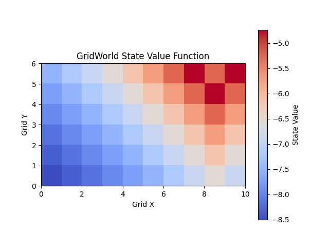
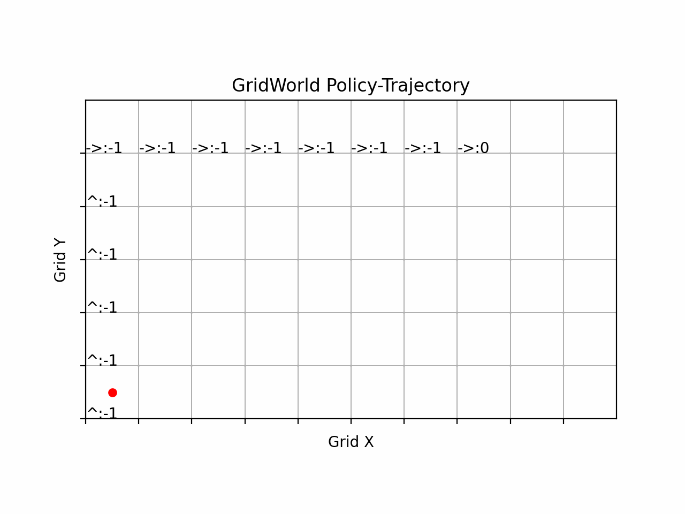

# rlearn.py
Reinforcement Learning Library [developing...]

## Installation
```bash
cd rlearn.py
pip install -e . # developing, please install in editable mode
```
## Symbols
### Common Symbols
| Symbol | Description | Symbol | Description |
|:---:|:---|:---:|:---|
| s | state | a | action |
| π/pi | policy | ε/epsilon | exploration rate |
| γ/gamma | gamma: discount factor | θ/theta | network parameter |
| α/alpha | alpha: learning rate | β/beta | beta |
| τ/tau | soft-update rate | μ/mu | mu |
| σ/sigma | sigma | ω/omega | omega |
| ∑ | sum | ∇/nabla | gradient |
| ∂/partial | partial derivative |

## Methods
| state | Agent | version | description | demo |   
|:---:|:---:|:---:|:---|:---|
| ✅ | StateTableAgent   | v0.0.1 | Value-Iteration Method [v0.0.1] | [demo](examples/demo_state_table_agent.py)
| ✅ | PolicyTableAgent  | v0.0.1 | Policy-Iteration Method (with Truncate option) [v0.0.1] | [demo](examples/demo_policy_table_agent.py)
| ✅ | QTableAgent       | v0.0.1 | Tablar-Q-learning Method [on-policy] [v0.0.1] | [demo](examples/demo_q_table_agent.py)
| ✅ | SarsaTableAgent   | v0.0.1 | SARSA Method [on-policy] [v0.0.1] | [demo](examples/demo_sarsa_table_agent.py) |
| ✅ | DQNAgent_Main     | v0.1.2 | DQN-main<br> ✅ DQN-double option<br> ✅  DQN-dueling option<br> ✅ gradient-clip option<br> ✅ noisy-net option<br> ⬜ support cuda<br> ⬜ more tests<br> ⬜ doc | [demo](tests/methods/dqn/test_dqn_main.py) |
| ✅ | NStepQAgent       | v0.1.0 | N-Step Q-learning | [demo](tests/methods/table_ii/test_nstep_q.py) |
| ✅ | NStepSarsaAgent   | v0.1.0 | N-Step SARSA | [demo](tests/methods/table_ii/test_nstep_sarsa.py) |
| ⬜ | DQN-double        | v0.0.1 | DQN-double | 
| ⬜ | DDPG              | v0.0.0 | DDPG | 
| ⬜ | HER               | v0.0.0 | Hindsight Experience Replay | 
| ✅ | MCPGAgent_Naive   | v0.0.1 | Monte-Carlo Policy Gradient | [demo](examples/demo_mc_pg_agent.py) |
| ⬜ | TRPO              | v0.0.0 | Trust Region Policy Optimization
| ⬜ | PPO               | v0.0.0 | Proximal Policy Optimization
| ⬜ | A2C               | v0.0.0 | Advantage Actor-Critic
| ⬜ | A3C               | v0.0.0 | Asynchronous Advantage Actor-Critic
| ⬜ | QAC               | v0.0.0 | Q Actor-Critic
| ⬜ | TD3               | v0.0.0 | Twin Delayed DDPG
| ⬜ | SAC               | v0.0.0 | Soft Actor-Critic
| ⬜ | [REDQ](https://arxiv.org/abs/2101.05982) | v0.0.0 | Randomized Ensembled Double Q-learning
| ⬜ | [DroQ](https://github.com/TakuyaHiraoka/Dropout-Q-Functions-for-Doubly-Efficient-Reinforcement-Learning) | v0.0.0 | Dropout Q-learning
| ⬜ | [PETS](https://arxiv.org/abs/2203.05442) | v0.0.0 | Parameter Efficient Twin Delayed DDPG

## TODOs
- [ ] unified interface for all methods | 为所有方法统一接口
- [ ] DQN-main: interface not stable & not tested on GPU | DQN-main: 接口不稳定且未在GPU上测试
- [ ] QTableAgent.learn(): return rewards-list | QTableAgent.learn(): 返回奖励列表
- [ ] support cuda and test on GPU | 支持cuda并测试GPU
- [ ] add more tests | 添加更多测试
- [ ] remove unused code & optimize performance | 删除未使用的代码并优化性能
- [ ] optimize code style & naming | 优化代码风格和命名
- [ ] torch-style ReplayBuffer | torch风格的ReplayBuffer
- [ ] better reward exit condition | 更好的奖励退出条件
- [ ] add more examples | 添加更多例子

## Examples 例子
### DQN-main Demo
Use DQN-main
```python
# examples/demo_dqn_main_agent.py
import gymnasium as gym
from rlearn.utils.seed import seed_all
from rlearn.methods.dqn.main import DQNAgent_Main

seed = 36
seed_all(seed)

env = gym.make('CartPole-v1')
config = {
    'prioritized_replay': True,
    'double_dqn': True,
    'dueling_dqn': True,
    'epsilon_start': 1.0,
    'epsilon_end': 0.1,
    'epsilon_decay': 0.995,
    'gamma': 0.99,
}
agent = DQNAgent_Main(env, config=config)
exit_code, info = agent.learn(num_episodes=1000, 
                                         max_step_per_episode=500, 
                                         max_total_steps=100000,
                                         target_reward=300, 
                                         seed=seed)
print(f'{exit_code=}, {info=}')
# 保存模型 | Save the model
# agent.save("dqn_main_agent.pth")
```
### Grid-World Demo
Use State-Value-Agent (State Value Iteration Method)
```
start: (0,0)
target: (5,8)
```
| Image 1 | Image 2 |
|---------|---------|
| | |

```python
# examples/demo_state_table_agent.py

import os
import torch
from rlearn.envs import grid_world
from rlearn.utils.seed import seed_all
from rlearn.methods.table import StateTableAgent
import matplotlib.pyplot as plt

seed_all(36) # make reproducible

# create env | 创建环境
env = grid_world.GridWorldEnv(shape=(6, 10), initial_state=(0,0), target_state=(5,8))
agent = StateTableAgent("agent1", env=env)

# 初始化状态值 | initialize state values
initial_state_values = 100*torch.randn(len(env.observation_space))

# 学习 | learn
exit_code, (policy_table, Q_table, state_values), info = agent.learn(
    initial_state_values, gamma=0.9, eps_exit=1e-6,
    max_iter= 100, verbose_freq=10
)

# 绘制状态值 | plot state values
fig = grid_world.plot_state_values(env, state_values)
os.makedirs('./images', exist_ok=True)
fig.savefig('images/grid_world_state_values.png')

# 生成一个episode | generate an episode
episode, done = env.generate_episode(agent, (0,0))
print(f'{episode=}, {done=}')

# 绘制episode | plot episode
ani = grid_world.animate_episode(env, episode, interval=200)
file_to_save='images/grid_world_policy.gif' # None: do not save to file
ani.save(file_to_save, writer='pillow', fps=20)

plt.show()
```

Output:
```
 2024-09-04 16:26:06 | INFO | 10/100: dif-norm: 83.509293
 2024-09-04 16:26:06 | INFO | 20/100: dif-norm: 28.261782
 2024-09-04 16:26:06 | INFO | 30/100: dif-norm: 9.838606
 2024-09-04 16:26:06 | INFO | 40/100: dif-norm: 3.430509
 2024-09-04 16:26:06 | INFO | 50/100: dif-norm: 1.196144
 2024-09-04 16:26:06 | INFO | 60/100: dif-norm: 0.417070
 2024-09-04 16:26:06 | INFO | 70/100: dif-norm: 0.145423
 2024-09-04 16:26:06 | INFO | 80/100: dif-norm: 0.050706
 2024-09-04 16:26:06 | INFO | 90/100: dif-norm: 0.017679
 2024-09-04 16:26:06 | INFO | 100/100: dif-norm: 0.006164
 2024-09-04 16:26:06 | WARNING | Exit: Reach Max-Iter
episode=[((0, 0), '^', -1), ((1, 0), '^', -1), ((2, 0), '^', -1), ((3, 0), '^', -1), ((4, 0), '^', -1), ((5, 0), '->', -1), ((5, 1), '->', -1), ((5, 2), '->', -1), ((5, 3), '->', -1), ((5, 4), '->', -1), ((5, 5), '->', -1), ((5, 6), '->', -1), ((5, 7), '->', 0)], done=True
```

## Others
### Config
Config is a easy-to-use config loader with following features:
- light-weight and easy-to-use | 轻量级且简单易用
- missing key warning | 缺失key提醒 
- get value by nested key(s) .e.g. `method.optim` | 通过嵌套key(s)获取值，如`method.optim`
- check type and value range | 检查类型和值范围
- support check by field name | 支持通过字段名检查
- load from dict/json/yaml file | 从dict/json/yaml文件中加载
- save to json/yaml file | 保存为json/yaml文件

Simple: 
```python
from rlearn.utils import config

cfg = config.from_dict({'method': {'optim': 'sgd', 'lr': 0.001}})
lr = cfg.get_required('method.lr', min=0.001, is_numeric=True)
optim = cfg.get_optional('method.optim', is_str=True, in_values=['sgd', 'adam'])
value = cfg.get_optional('method.value', default=0.001, min=0.001, is_float=True)

cfg.set('method.v_min', 3.0, is_float=True, gt=0) # gt: greater than
cfg.set('method.v_max', 5.0, is_float=True, gt='method.v_min') # gt: greater than

print(f'lr: {lr}, optim: {optim}, value: {value}')
# lr: 0.001, optim: sgd, value: 0.001
cfg.to_json_file('demo_config/hello.json')
cfg_loaded = config.from_json_file('demo_config/hello.json')
# print(cfg_loaded.to_dict())

```
More: [examples/demo_config_file.py](examples/demo_config_file.py)

## ChangeLog
- [@2024-08-23] 项目创建project created
- [@2024-08-28] add: state-value-iteration method
- [@2024-09-04] tag: v0.0.2: re-design: Agent/Env, StateTableAgent, PolicyTableAgent
- [@2024-09-05] tag: v0.0.3: QTableAgent, SarsaTableAgent
- [@2024-09-08] add: rlearn.utils.config: easy-to-use config loader
- [@2024-09-08] add: DQN-main@v0.0.1: DQN-main double, dueling, prioritized replay
- [@2024-09-09] add: MCPG-naive@v0.0.1: `reinforce` method

## Reference
- 《Math Foundation of Reinforcement Learning》by [Shiyu Zhao]
- 《深度强化学习》by Wang Shuseng 王树森
- gym
- stable-baselines3
- more ..
